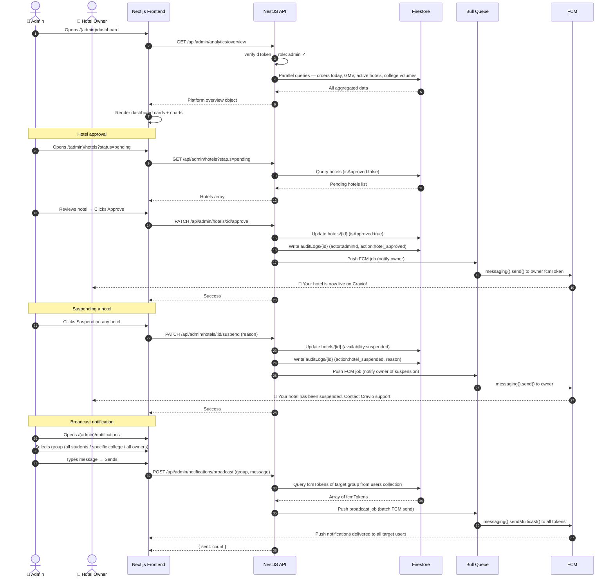

```mermaid
sequenceDiagram
    autonumber
    actor A as 👑 Admin
    actor O as 🏨 Hotel Owner
    participant FE as Next.js Frontend
    participant NE as NestJS API
    participant FS as Firestore
    participant BQ as Bull Queue
    participant FC as FCM

    A->>FE: Opens /(admin)/dashboard
    FE->>NE: GET /api/admin/analytics/overview
    NE->>NE: verifyIdToken → role: admin ✓
    NE->>FS: Parallel queries — orders today, GMV, active hotels, college volumes
    FS-->>NE: All aggregated data
    NE-->>FE: Platform overview object
    FE->>FE: Render dashboard cards + charts

    Note over A,FE: Hotel approval

    A->>FE: Opens /(admin)/hotels?status=pending
    FE->>NE: GET /api/admin/hotels?status=pending
    NE->>FS: Query hotels (isApproved:false)
    FS-->>NE: Pending hotels list
    NE-->>FE: Hotels array
    A->>FE: Reviews hotel → Clicks Approve
    FE->>NE: PATCH /api/admin/hotels/:id/approve
    NE->>FS: Update hotels/{id} (isApproved:true)
    NE->>FS: Write auditLogs/{id} (actor:adminId, action:hotel_approved)
    NE->>BQ: Push FCM job (notify owner)
    BQ->>FC: messaging().send() to owner fcmToken
    FC-->>O: 🔔 Your hotel is now live on Cravio!
    NE-->>FE: Success

    Note over A,FE: Suspending a hotel

    A->>FE: Clicks Suspend on any hotel
    FE->>NE: PATCH /api/admin/hotels/:id/suspend (reason)
    NE->>FS: Update hotels/{id} (availability:suspended)
    NE->>FS: Write auditLogs/{id} (action:hotel_suspended, reason)
    NE->>BQ: Push FCM job (notify owner of suspension)
    BQ->>FC: messaging().send() to owner
    FC-->>O: 🔔 Your hotel has been suspended. Contact Cravio support.
    NE-->>FE: Success

    Note over A,FE: Broadcast notification

    A->>FE: Opens /(admin)/notifications
    A->>FE: Selects group (all students / specific college / all owners)
    A->>FE: Types message → Sends
    FE->>NE: POST /api/admin/notifications/broadcast (group, message)
    NE->>FS: Query fcmTokens of target group from users collection
    FS-->>NE: Array of fcmTokens
    NE->>BQ: Push broadcast job (batch FCM send)
    BQ->>FC: messaging().sendMulticast() to all tokens
    FC-->>FE: Push notifications delivered to all target users
    NE-->>FE: { sent: count }

```