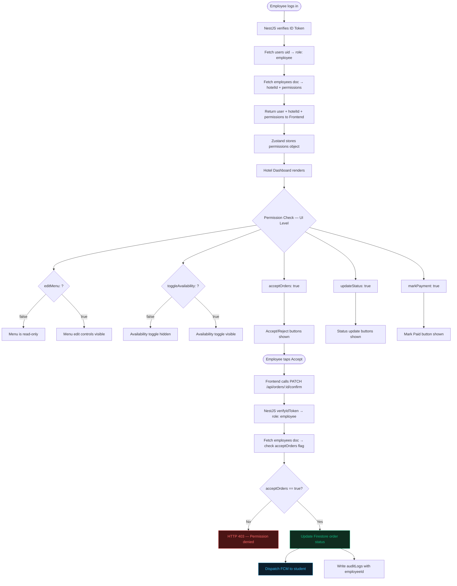

```mermaid
flowchart TD
    A([Employee logs in]) --> B[NestJS verifies ID Token]
    B --> C[Fetch users uid → role: employee]
    C --> D[Fetch employees doc → hotelId + permissions]
    D --> E[Return user + hotelId + permissions to Frontend]
    E --> F[Zustand stores permissions object]
    F --> G[Hotel Dashboard renders]

    G --> H{Permission Check — UI Level}

    H --> I[acceptOrders: true]
    H --> J[updateStatus: true]
    H --> K[markPayment: true]
    H --> L{editMenu: ?}
    H --> M{toggleAvailability: ?}

    L -->|false| N[Menu is read-only]
    L -->|true| O[Menu edit controls visible]

    M -->|false| P[Availability toggle hidden]
    M -->|true| Q[Availability toggle visible]

    I --> R[Accept/Reject buttons shown]
    J --> S[Status update buttons shown]
    K --> T[Mark Paid button shown]

    R --> U([Employee taps Accept])
    U --> V[Frontend calls PATCH /api/orders/:id/confirm]
    V --> W[NestJS verifyIdToken → role: employee]
    W --> X[Fetch employees doc → check acceptOrders flag]
    X --> Y{acceptOrders == true?}
    Y -->|No| Z[HTTP 403 — Permission denied]
    Y -->|Yes| AA[Update Firestore order status]
    AA --> AB[Dispatch FCM to student]
    AA --> AC[Write auditLogs with employeeId]

    style Z fill:#4B1515,color:#ff6b6b,stroke:#ff6b6b
    style AA fill:#0f2d1f,color:#10B981,stroke:#10B981
    style AB fill:#0d1f2d,color:#38BDF8,stroke:#38BDF8
```