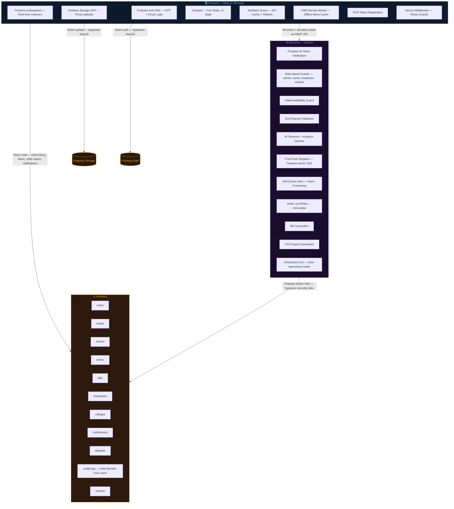

```mermaid
flowchart TD
    subgraph FE["🖥️ Frontend — Next.js / Browser"]
        A1[Firebase Auth SDK — OTP + Email Login]
        A2[Firebase Storage SDK — Photo Uploads]
        A3[Firestore onSnapshot — Real-time Listeners]
        A4[Zustand — Cart State, UI State]
        A5[TanStack Query — API Cache + Refetch]
        A6[PWA Service Worker — Offline Menu Cache]
        A7[FCM Token Registration]
        A8[Next.js Middleware — Route Guards]
    end

    subgraph BE["⚙️ Backend — NestJS"]
        B1[Firebase ID Token Verification]
        B2[Role-based Guards — admin, owner, employee, student]
        B3[Hotel Availability Guard]
        B4[Zod Request Validation]
        B5[All Revenue + Analytics Queries]
        B6[FCM Push Dispatch — Firebase Admin SDK]
        B7[Bull Queue Jobs — Async Processing]
        B8[Audit Log Writes — Immutable]
        B9[Bill Generation]
        B10[CSV Export Generation]
        B11[Scheduled Cron — Auto open/close hotels]
    end

    subgraph DB["🔥 Firestore"]
        C1[users]
        C2[hotels]
        C3[menus]
        C4[orders]
        C5[bills]
        C6[employees]
        C7[colleges]
        C8[notifications]
        C9[disputes]
        C10[auditLogs — write blocked from client]
        C11[reviews]
    end

    A3 -->|Direct read — hotel listing, menu, order status, notifications| DB
    A2 -->|Direct upload — bypasses NestJS| FSS[(Firebase Storage)]
    A1 -->|Direct auth — bypasses NestJS| FAU[(Firebase Auth)]

    FE -->|All writes + sensitive reads via REST API| BE
    BE -->|Firebase Admin SDK — bypasses security rules| DB

    style FE fill:#0d1a2d,stroke:#38BDF8,color:#38BDF8
    style BE fill:#1a0d2d,stroke:#818CF8,color:#818CF8
    style DB fill:#2d1a0d,stroke:#F59E0B,color:#F59E0B
    style FSS fill:#2d1a0d,stroke:#F59E0B,color:#F59E0B
    style FAU fill:#2d1a0d,stroke:#F59E0B,color:#F59E0B
```