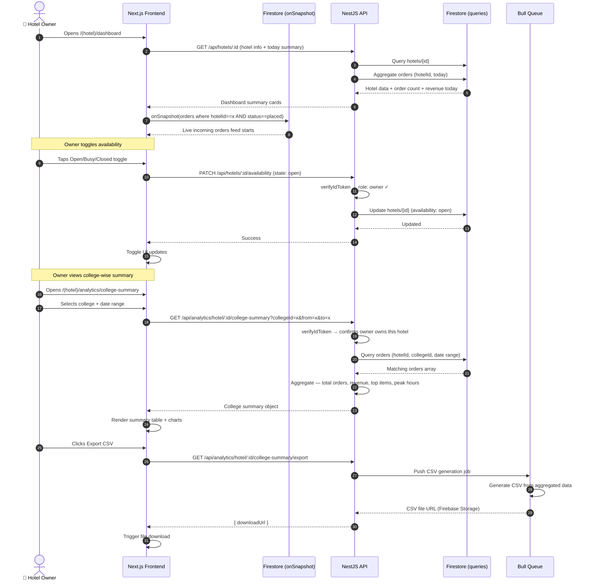

```mermaid
sequenceDiagram
    autonumber
    actor O as 🏨 Hotel Owner
    participant FE as Next.js Frontend
    participant FS as Firestore (onSnapshot)
    participant NE as NestJS API
    participant FS2 as Firestore (queries)
    participant BQ as Bull Queue

    O->>FE: Opens /(hotel)/dashboard
    FE->>NE: GET /api/hotels/:id (hotel info + today summary)
    NE->>FS2: Query hotels/{id}
    NE->>FS2: Aggregate orders (hotelId, today)
    FS2-->>NE: Hotel data + order count + revenue today
    NE-->>FE: Dashboard summary cards

    FE->>FS: onSnapshot(orders where hotelId==x AND status==placed)
    FS-->>FE: Live incoming orders feed starts

    Note over O,FE: Owner toggles availability

    O->>FE: Taps Open/Busy/Closed toggle
    FE->>NE: PATCH /api/hotels/:id/availability (state: open)
    NE->>NE: verifyIdToken → role: owner ✓
    NE->>FS2: Update hotels/{id} (availability: open)
    FS2-->>NE: Updated
    NE-->>FE: Success
    FE->>FE: Toggle UI updates

    Note over O,FE: Owner views college-wise summary

    O->>FE: Opens /(hotel)/analytics/college-summary
    O->>FE: Selects college + date range
    FE->>NE: GET /api/analytics/hotel/:id/college-summary?collegeId=x&from=x&to=x
    NE->>NE: verifyIdToken → confirms owner owns this hotel
    NE->>FS2: Query orders (hotelId, collegeId, date range)
    FS2-->>NE: Matching orders array
    NE->>NE: Aggregate — total orders, revenue, top items, peak hours
    NE-->>FE: College summary object
    FE->>FE: Render summary table + charts

    O->>FE: Clicks Export CSV
    FE->>NE: GET /api/analytics/hotel/:id/college-summary/export
    NE->>BQ: Push CSV generation job
    BQ->>BQ: Generate CSV from aggregated data
    BQ-->>NE: CSV file URL (Firebase Storage)
    NE-->>FE: { downloadUrl }
    FE->>FE: Trigger file download
```