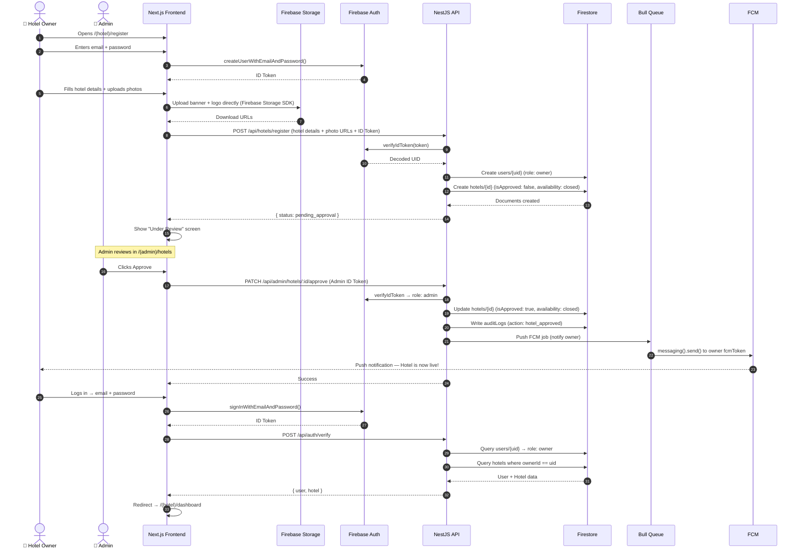

```mermaid
sequenceDiagram
    autonumber
    actor O as 🏨 Hotel Owner
    actor A as 👑 Admin
    participant FE as Next.js Frontend
    participant FS_S as Firebase Storage
    participant FA as Firebase Auth
    participant NE as NestJS API
    participant FS as Firestore
    participant BQ as Bull Queue
    participant FC as FCM

    O->>FE: Opens /(hotel)/register
    O->>FE: Enters email + password
    FE->>FA: createUserWithEmailAndPassword()
    FA-->>FE: ID Token

    O->>FE: Fills hotel details + uploads photos
    FE->>FS_S: Upload banner + logo directly (Firebase Storage SDK)
    FS_S-->>FE: Download URLs

    FE->>NE: POST /api/hotels/register (hotel details + photo URLs + ID Token)
    NE->>FA: verifyIdToken(token)
    FA-->>NE: Decoded UID
    NE->>FS: Create users/{uid} (role: owner)
    NE->>FS: Create hotels/{id} (isApproved: false, availability: closed)
    FS-->>NE: Documents created
    NE-->>FE: { status: pending_approval }
    FE->>FE: Show "Under Review" screen

    Note over A,FE: Admin reviews in /(admin)/hotels

    A->>FE: Clicks Approve
    FE->>NE: PATCH /api/admin/hotels/:id/approve (Admin ID Token)
    NE->>FA: verifyIdToken → role: admin
    NE->>FS: Update hotels/{id} (isApproved: true, availability: closed)
    NE->>FS: Write auditLogs (action: hotel_approved)
    NE->>BQ: Push FCM job (notify owner)
    BQ->>FC: messaging().send() to owner fcmToken
    FC-->>O: Push notification — Hotel is now live!
    NE-->>FE: Success

    O->>FE: Logs in → email + password
    FE->>FA: signInWithEmailAndPassword()
    FA-->>FE: ID Token
    FE->>NE: POST /api/auth/verify
    NE->>FS: Query users/{uid} → role: owner
    NE->>FS: Query hotels where ownerId == uid
    FS-->>NE: User + Hotel data
    NE-->>FE: { user, hotel }
    FE->>FE: Redirect → /(hotel)/dashboard
```