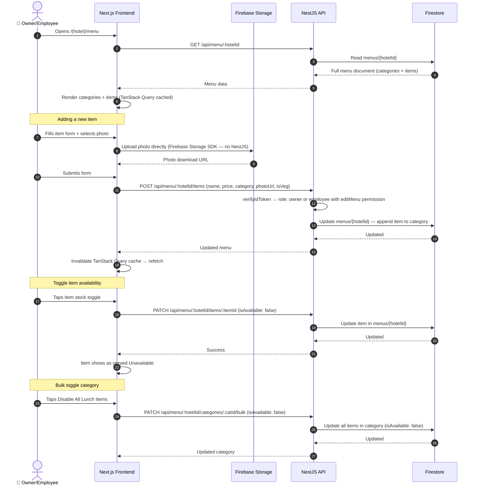

```mermaid
sequenceDiagram
    autonumber
    actor O as 🏨 Owner/Employee
    participant FE as Next.js Frontend
    participant FSS as Firebase Storage
    participant NE as NestJS API
    participant FS as Firestore

    O->>FE: Opens /(hotel)/menu
    FE->>NE: GET /api/menu/:hotelId
    NE->>FS: Read menus/{hotelId}
    FS-->>NE: Full menu document (categories + items)
    NE-->>FE: Menu data
    FE->>FE: Render categories + items (TanStack Query cached)

    Note over O,FE: Adding a new item

    O->>FE: Fills item form + selects photo
    FE->>FSS: Upload photo directly (Firebase Storage SDK — no NestJS)
    FSS-->>FE: Photo download URL
    O->>FE: Submits form
    FE->>NE: POST /api/menu/:hotelId/items (name, price, category, photoUrl, isVeg)
    NE->>NE: verifyIdToken → role: owner or employee with editMenu permission
    NE->>FS: Update menus/{hotelId} — append item to category
    FS-->>NE: Updated
    NE-->>FE: Updated menu
    FE->>FE: Invalidate TanStack Query cache → refetch

    Note over O,FE: Toggle item availability

    O->>FE: Taps item stock toggle
    FE->>NE: PATCH /api/menu/:hotelId/items/:itemId (isAvailable: false)
    NE->>FS: Update item in menus/{hotelId}
    FS-->>NE: Updated
    NE-->>FE: Success
    FE->>FE: Item shows as greyed Unavailable

    Note over O,FE: Bulk toggle category

    O->>FE: Taps Disable All Lunch Items
    FE->>NE: PATCH /api/menu/:hotelId/categories/:catId/bulk (isAvailable: false)
    NE->>FS: Update all items in category (isAvailable: false)
    FS-->>NE: Updated
    NE-->>FE: Updated category
```