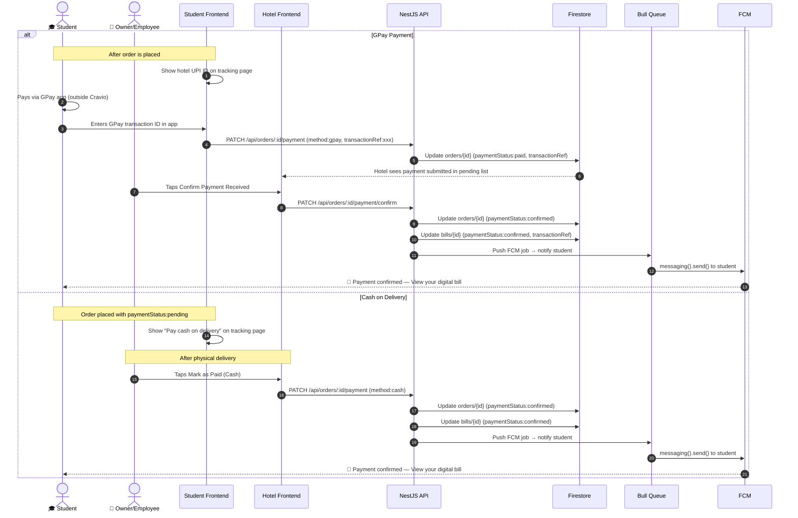

```mermaid
sequenceDiagram
    autonumber
    actor S as 🎓 Student
    actor HO as 🏨 Owner/Employee
    participant FE_S as Student Frontend
    participant FE_H as Hotel Frontend
    participant NE as NestJS API
    participant FS as Firestore
    participant BQ as Bull Queue
    participant FC as FCM

    alt GPay Payment
        Note over S,FE_S: After order is placed
        FE_S->>FE_S: Show hotel UPI ID on tracking page
        S->>S: Pays via GPay app (outside Cravio)
        S->>FE_S: Enters GPay transaction ID in app
        FE_S->>NE: PATCH /api/orders/:id/payment (method:gpay, transactionRef:xxx)
        NE->>FS: Update orders/{id} (paymentStatus:paid, transactionRef)
        FS-->>FE_H: Hotel sees payment submitted in pending list
        HO->>FE_H: Taps Confirm Payment Received
        FE_H->>NE: PATCH /api/orders/:id/payment/confirm
        NE->>FS: Update orders/{id} (paymentStatus:confirmed)
        NE->>FS: Update bills/{id} (paymentStatus:confirmed, transactionRef)
        NE->>BQ: Push FCM job → notify student
        BQ->>FC: messaging().send() to student
        FC-->>S: 🔔 Payment confirmed — View your digital bill
    else Cash on Delivery
        Note over S,FE_S: Order placed with paymentStatus:pending
        FE_S->>FE_S: Show "Pay cash on delivery" on tracking page
        Note over HO,FE_H: After physical delivery
        HO->>FE_H: Taps Mark as Paid (Cash)
        FE_H->>NE: PATCH /api/orders/:id/payment (method:cash)
        NE->>FS: Update orders/{id} (paymentStatus:confirmed)
        NE->>FS: Update bills/{id} (paymentStatus:confirmed)
        NE->>BQ: Push FCM job → notify student
        BQ->>FC: messaging().send() to student
        FC-->>S: 🔔 Payment confirmed — View your digital bill
    end
```