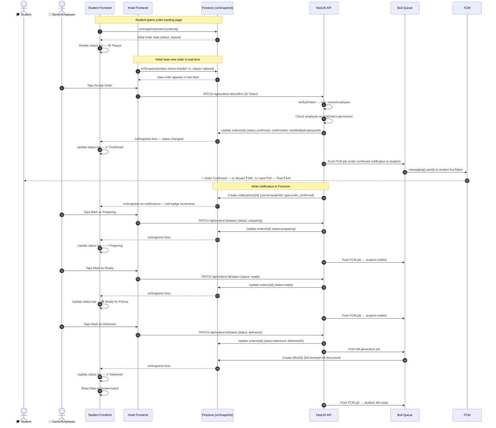

```mermaid
sequenceDiagram
    autonumber
    actor S as 🎓 Student
    actor HO as 🏨 Owner/Employee
    participant FE_S as Student Frontend
    participant FE_H as Hotel Frontend
    participant FS as Firestore (onSnapshot)
    participant NE as NestJS API
    participant BQ as Bull Queue
    participant FC as FCM

    Note over FE_S,FS: Student opens order tracking page

    FE_S->>FS: onSnapshot(orders/{orderId})
    FS-->>FE_S: Initial order data (status: placed)
    FE_S->>FE_S: Render status bar — 🟡 Placed

    Note over FE_H,FS: Hotel sees new order in real-time

    FE_H->>FS: onSnapshot(orders where hotelId==x, status==placed)
    FS-->>FE_H: New order appears in live feed

    HO->>FE_H: Taps Accept Order
    FE_H->>NE: PATCH /api/orders/:id/confirm (ID Token)
    NE->>NE: verifyIdToken → role: owner/employee
    NE->>NE: Check employee acceptOrders permission
    NE->>FS: Update orders/{id} (status:confirmed, confirmedAt, handledByEmployeeId)
    FS-->>FE_S: onSnapshot fires — status changed!
    FE_S->>FE_S: Update status bar — ✅ Confirmed
    NE->>BQ: Push FCM job (order confirmed notification to student)
    BQ->>FC: messaging().send() to student fcmToken
    FC-->>S: 🔔 Order Confirmed — 2x Biryani ₹280, 1x Lassi ₹60 — Total ₹340

    Note over NE,FS: Write notification to Firestore
    NE->>FS: Create notifications/{id} (userId:studentId, type:order_confirmed)
    FS-->>FE_S: onSnapshot on notifications — bell badge increments

    HO->>FE_H: Taps Mark as Preparing
    FE_H->>NE: PATCH /api/orders/:id/status (status: preparing)

    NE->>FS: Update orders/{id} (status:preparing)
    FS-->>FE_S: onSnapshot fires
    FE_S->>FE_S: Update status bar — 🍳 Preparing
    NE->>BQ: Push FCM job → student notified

    HO->>FE_H: Taps Mark as Ready
    FE_H->>NE: PATCH /api/orders/:id/status (status: ready)
    NE->>FS: Update orders/{id} (status:ready)
    FS-->>FE_S: onSnapshot fires
    FE_S->>FE_S: Update status bar — 🟢 Ready for Pickup
    NE->>BQ: Push FCM job → student notified

    HO->>FE_H: Taps Mark as Delivered
    FE_H->>NE: PATCH /api/orders/:id/status (status: delivered)
    NE->>FS: Update orders/{id} (status:delivered, deliveredAt)
    NE->>BQ: Push bill generation job
    BQ->>FS: Create bills/{id} (full itemised bill document)
    FS-->>FE_S: onSnapshot fires
    FE_S->>FE_S: Update status bar — ✅ Delivered
    FE_S->>FE_S: Show Rate & Review button
    NE->>BQ: Push FCM job → student: bill ready
```