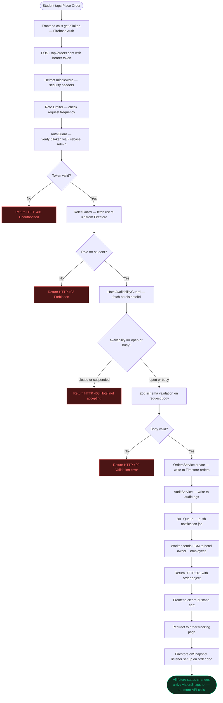

```mermaid
flowchart TD
    A([Student taps Place Order]) --> B[Frontend calls getIdToken — Firebase Auth]
    B --> C[POST /api/orders sent with Bearer token]
    C --> D[Helmet middleware — security headers]
    D --> E[Rate Limiter — check request frequency]
    E --> F[AuthGuard — verifyIdToken via Firebase Admin]
    F --> G{Token valid?}
    G -->|No| G1[Return HTTP 401 Unauthorized]
    G -->|Yes| H[RolesGuard — fetch users uid from Firestore]
    H --> I{Role == student?}
    I -->|No| I1[Return HTTP 403 Forbidden]
    I -->|Yes| J[HotelAvailabilityGuard — fetch hotels hotelId]
    J --> K{availability == open or busy?}
    K -->|closed or suspended| K1[Return HTTP 403 Hotel not accepting]
    K -->|open or busy| L[Zod schema validation on request body]
    L --> M{Body valid?}
    M -->|No| M1[Return HTTP 400 Validation error]
    M -->|Yes| N[OrdersService.create — write to Firestore orders]
    N --> O[AuditService — write to auditLogs]
    O --> P[Bull Queue — push notification job]
    P --> Q[Worker sends FCM to hotel owner + employees]
    Q --> R[Return HTTP 201 with order object]
    R --> S[Frontend clears Zustand cart]
    S --> T[Redirect to order tracking page]
    T --> U[Firestore onSnapshot listener set up on order doc]
    U --> V([All future status changes arrive via onSnapshot — no more API calls])

    style G1 fill:#4B1515,color:#ff6b6b,stroke:#ff6b6b
    style I1 fill:#4B1515,color:#ff6b6b,stroke:#ff6b6b
    style K1 fill:#4B1515,color:#ff6b6b,stroke:#ff6b6b
    style M1 fill:#4B1515,color:#ff6b6b,stroke:#ff6b6b
    style V fill:#0f2d1f,color:#10B981,stroke:#10B981
```