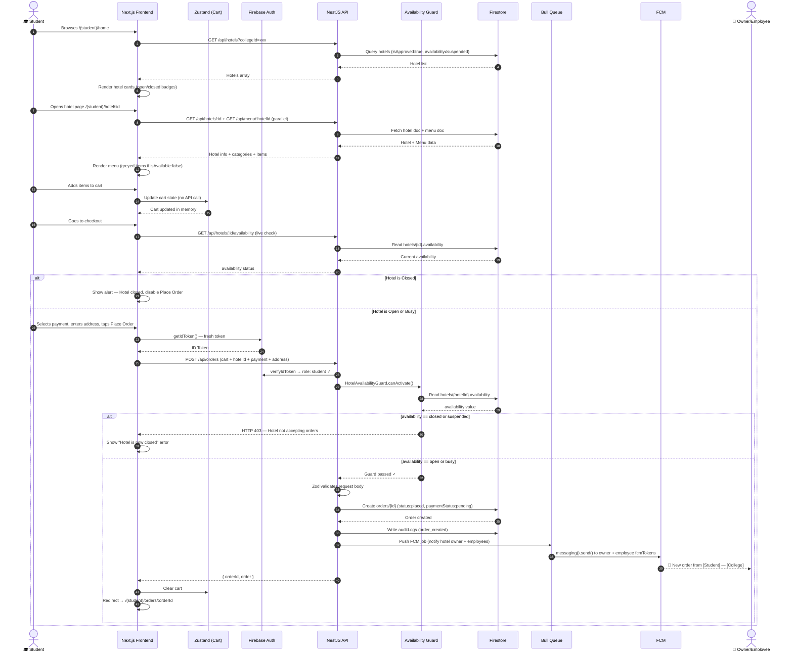

```mermaid
sequenceDiagram
    autonumber
    actor S as 🎓 Student
    participant FE as Next.js Frontend
    participant ZS as Zustand (Cart)
    participant FA as Firebase Auth
    participant NE as NestJS API
    participant AG as Availability Guard
    participant FS as Firestore
    participant BQ as Bull Queue
    participant FC as FCM
    actor HO as 🏨 Owner/Employee

    S->>FE: Browses /(student)/home
    FE->>NE: GET /api/hotels?collegeId=xxx
    NE->>FS: Query hotels (isApproved:true, availability≠suspended)
    FS-->>NE: Hotel list
    NE-->>FE: Hotels array
    FE->>FE: Render hotel cards (open/closed badges)

    S->>FE: Opens hotel page /(student)/hotel/:id
    FE->>NE: GET /api/hotels/:id + GET /api/menu/:hotelId (parallel)
    NE->>FS: Fetch hotel doc + menu doc
    FS-->>NE: Hotel + Menu data
    NE-->>FE: Hotel info + categories + items
    FE->>FE: Render menu (greyed items if isAvailable:false)

    S->>FE: Adds items to cart
    FE->>ZS: Update cart state (no API call)
    ZS-->>FE: Cart updated in memory

    S->>FE: Goes to checkout
    FE->>NE: GET /api/hotels/:id/availability (live check)
    NE->>FS: Read hotels/{id}.availability
    FS-->>NE: Current availability
    NE-->>FE: availability status

    alt Hotel is Closed
        FE->>FE: Show alert — Hotel closed, disable Place Order
    else Hotel is Open or Busy
        S->>FE: Selects payment, enters address, taps Place Order
        FE->>FA: getIdToken() — fresh token
        FA-->>FE: ID Token
        FE->>NE: POST /api/orders (cart + hotelId + payment + address)

        NE->>FA: verifyIdToken → role: student ✓
        NE->>AG: HotelAvailabilityGuard.canActivate()
        AG->>FS: Read hotels/{hotelId}.availability
        FS-->>AG: availability value

        alt availability == closed or suspended
            AG-->>FE: HTTP 403 — Hotel not accepting orders
            FE->>FE: Show "Hotel is now closed" error
        else availability == open or busy
            AG-->>NE: Guard passed ✓
            NE->>NE: Zod validates request body
            NE->>FS: Create orders/{id} (status:placed, paymentStatus:pending)
            FS-->>NE: Order created
            NE->>FS: Write auditLogs (order_created)
            NE->>BQ: Push FCM job (notify hotel owner + employees)
            BQ->>FC: messaging().send() to owner + employee fcmTokens
            FC-->>HO: 🔔 New order from [Student] — [College]
            NE-->>FE: { orderId, order }
            FE->>ZS: Clear cart
            FE->>FE: Redirect → /(student)/orders/:orderId
        end
    end
```