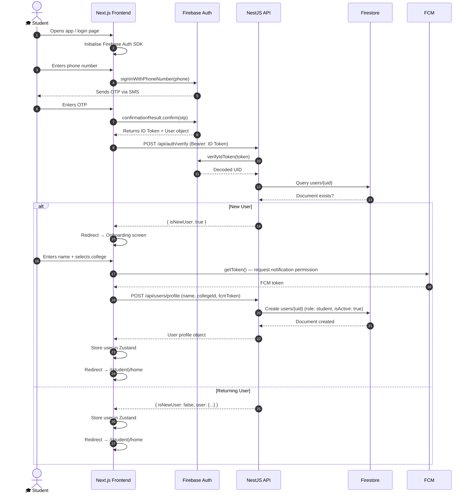

```mermaid
sequenceDiagram
    autonumber
    actor S as 🎓 Student
    participant FE as Next.js Frontend
    participant FA as Firebase Auth
    participant NE as NestJS API
    participant FS as Firestore
    participant FC as FCM

    S->>FE: Opens app / login page
    FE->>FE: Initialise Firebase Auth SDK
    S->>FE: Enters phone number
    FE->>FA: signInWithPhoneNumber(phone)
    FA-->>S: Sends OTP via SMS
    S->>FE: Enters OTP
    FE->>FA: confirmationResult.confirm(otp)
    FA-->>FE: Returns ID Token + User object

    FE->>NE: POST /api/auth/verify (Bearer: ID Token)
    NE->>FA: verifyIdToken(token)
    FA-->>NE: Decoded UID
    NE->>FS: Query users/{uid}
    FS-->>NE: Document exists?

    alt New User
        NE-->>FE: { isNewUser: true }
        FE->>FE: Redirect → Onboarding screen
        S->>FE: Enters name + selects college
        FE->>FC: getToken() — request notification permission
        FC-->>FE: FCM token
        FE->>NE: POST /api/users/profile (name, collegeId, fcmToken)
        NE->>FS: Create users/{uid} (role: student, isActive: true)
        FS-->>NE: Document created
        NE-->>FE: User profile object
        FE->>FE: Store user in Zustand
        FE->>FE: Redirect → /(student)/home
    else Returning User
        NE-->>FE: { isNewUser: false, user: {...} }
        FE->>FE: Store user in Zustand
        FE->>FE: Redirect → /(student)/home
    end
```